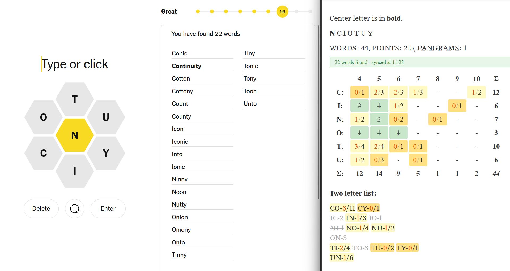

# Spelling Bee Grid Tracker

A Firefox extension that tracks your NYT Spelling Bee words.



## Official Mozilla add-on page

https://addons.mozilla.org/en-US/firefox/addon/spelling-bee-hint-tracker

## Building

Requires [Node.js](https://nodejs.org/) and `web-ext`:

```bash
npm install -g web-ext
bash build.sh
```

If you're on Windows and have WSL/WSL2 installed then you need to install `nodejs` and `npm` with the package manager in a WSL shell. After that continue as above, i.e. install `web-ext`: `sudo npm install -g web-ext`

The XPI will be saved to `./web-ext-artifacts/`.

## How to install (temporary, for development)

1. Open Firefox and go to `about:debugging`
2. Click **This Firefox** in the left sidebar
3. Click **Load Temporary Add-on...**
4. Navigate to this folder and select `manifest.json`

The extension is now active. It will stay loaded until you restart Firefox.

Click `Reload` on the same page to reload any dev changes you make.

## Usage

1. Open NYT Spelling Bee, i.e.: https://www.nytimes.com/puzzles/spelling-bee

2. Open the hints page in a new browser window, e.g.: https://www.nytimes.com/2026/02/24/crosswords/spelling-bee-forum.html

3. Move and resize the windows so you can see both the puzzle and the hints at the same time.

4. As you find words, the hints grid will update with the counts

Puzzles are stored in local browser storage for three days before being removed.

## License

[MIT](LICENSE) © 2026 Michael Champanis
